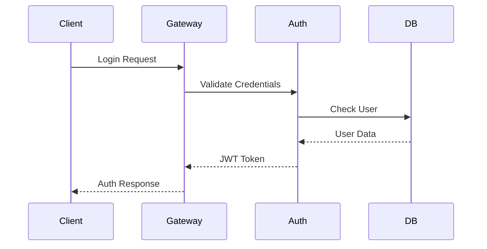
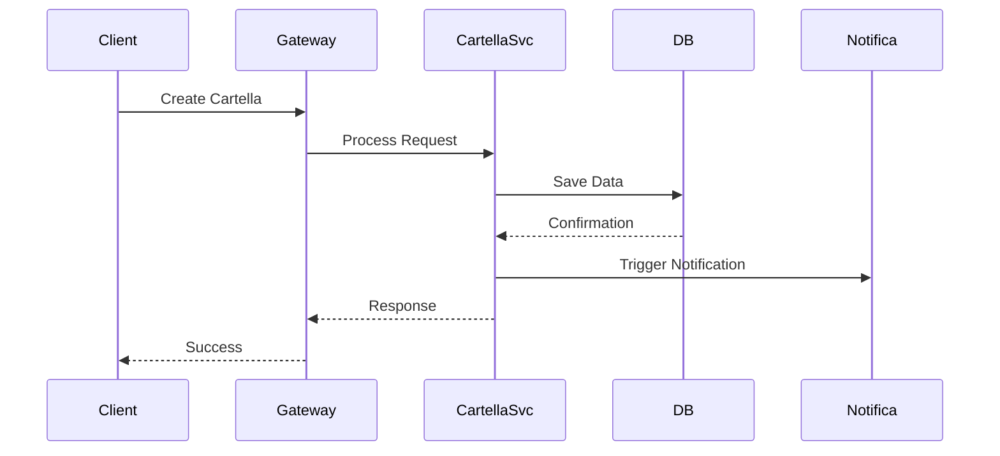

# 🏗️ ARCHITETTURA DEL SISTEMA

## Panoramica

Il Sistema di Gestione Cartella Clinica Digitale è costruito seguendo un'architettura moderna a microservizi, progettata per garantire scalabilità, sicurezza e manutenibilità.

---

## 📐 Architettura Generale

### Stack Tecnologico

#### Frontend
- **Framework**: React 18.x con TypeScript
- **State Management**: Redux Toolkit
- **UI Components**: Material-UI v5
- **Grafici**: Recharts / D3.js
- **Form Management**: React Hook Form
- **Routing**: React Router v6

#### Backend
- **Runtime**: Node.js v18 LTS
- **Framework**: Express.js / Fastify
- **ORM**: Prisma
- **Authentication**: JWT + Passport.js
- **API Documentation**: Swagger/OpenAPI 3.0

#### Database
- **Primary DB**: PostgreSQL 14+
- **Cache**: Redis
- **File Storage**: MinIO / S3-compatible
- **Search Engine**: Elasticsearch (opzionale)

#### DevOps
- **Containerization**: Docker
- **Orchestration**: Docker Compose / Kubernetes
- **CI/CD**: GitHub Actions
- **Monitoring**: Prometheus + Grafana

---

## 🔧 Componenti Principali

### 1. API Gateway
Punto di ingresso unico per tutte le richieste client.

**Responsabilità:**
- Routing delle richieste
- Rate limiting
- Authentication/Authorization
- Load balancing
- Request/Response transformation

### 2. Servizio Autenticazione
Gestisce l'autenticazione e autorizzazione degli utenti.

**Funzionalità:**
- Login multi-fattore
- Gestione sessioni
- Token JWT
- RBAC (Role-Based Access Control)
- OAuth2 integration

### 3. Servizio Gestione Pazienti
Core service per la gestione anagrafica pazienti.

**Capabilities:**
- CRUD pazienti
- Ricerca avanzata
- Import/Export dati
- Validazione codice fiscale
- Gestione consensi GDPR

### 4. Servizio Cartelle Cliniche
Gestione completa delle cartelle cliniche digitali.

**Features:**
- Creazione/modifica cartelle
- Versionamento documenti
- Firma digitale
- Template personalizzabili
- Audit trail completo

### 5. Servizio Body Mapping
Sistema interattivo per documentazione zone trattamento.

**Tecnologie:**
- Canvas API / SVG
- WebGL per rendering 3D
- Touch gesture support
- Annotazioni real-time
- Export immagini HD

### 6. Servizio Intelligenza Artificiale
Integrazione con sistemi AI per assistenza clinica.

**Capabilities:**
- Analisi predittiva
- Suggerimenti diagnosi
- NLP per documenti
- Pattern recognition
- Knowledge base learning

### 7. Servizio Documenti
Gestione documentale e generazione report.

**Features:**
- Generazione PDF dinamica
- Template engine
- Conversione formati
- Digital signature
- Archiviazione sicura

### 8. Servizio Notifiche
Sistema di notifiche multi-canale.

**Canali supportati:**
- Email (SMTP)
- SMS
- Push notifications
- In-app notifications
- Webhook integrations

---

## 🔄 Flussi di Dati

### Flusso Autenticazione


### Flusso Creazione Cartella


---

## 🔐 Sicurezza

### Livelli di Sicurezza

#### 1. Network Security
- HTTPS/TLS 1.3 everywhere
- VPN per accessi amministrativi
- Firewall configurato
- DDoS protection

#### 2. Application Security
- Input validation
- SQL injection prevention
- XSS protection
- CSRF tokens
- Content Security Policy

#### 3. Data Security
- Encryption at rest (AES-256)
- Encryption in transit
- Field-level encryption per dati sensibili
- Secure key management (HashiCorp Vault)

#### 4. Access Control
- Multi-factor authentication
- Role-based permissions
- API key management
- Session management
- Audit logging

---

## 📈 Scalabilità

### Strategie di Scaling

#### Horizontal Scaling
- Microservizi stateless
- Load balancing (NGINX/HAProxy)
- Container orchestration
- Auto-scaling policies

#### Vertical Scaling
- Resource optimization
- Database indexing
- Query optimization
- Caching strategies

#### Data Partitioning
- Database sharding
- Read replicas
- Data archiving
- CDN per assets statici

---

## 🔄 Pattern Architetturali

### 1. Microservices Pattern
Ogni servizio è indipendente e scalabile autonomamente.

### 2. Event-Driven Architecture
Comunicazione asincrona tra servizi via message queue.

### 3. CQRS (Command Query Responsibility Segregation)
Separazione tra operazioni di lettura e scrittura.

### 4. Repository Pattern
Astrazione dell'accesso ai dati.

### 5. Factory Pattern
Creazione oggetti complessi.

### 6. Observer Pattern
Notifiche real-time.

### 7. Circuit Breaker
Gestione fallimenti servizi esterni.

---

## 🌐 API Design

### RESTful Principles
- Resource-based URLs
- HTTP methods semantici
- Status codes standard
- HATEOAS where applicable

### Endpoint Structure
```
GET    /api/v1/patients          # Lista pazienti
POST   /api/v1/patients          # Crea paziente
GET    /api/v1/patients/{id}     # Dettaglio paziente
PUT    /api/v1/patients/{id}     # Aggiorna paziente
DELETE /api/v1/patients/{id}     # Elimina paziente
```

### Response Format
```json
{
  "success": true,
  "data": {
    "id": "123",
    "name": "Mario Rossi",
    "created_at": "2025-08-10T10:00:00Z"
  },
  "meta": {
    "page": 1,
    "total": 100
  }
}
```

---

## 🔌 Integrazioni

### Sistemi Esterni Supportati
- HL7 FHIR per interoperabilità
- DICOM per imaging medicale
- Tessera Sanitaria API
- PagoPA per pagamenti
- SPID/CIE per autenticazione

### Webhook System
Sistema eventi per integrazioni real-time con sistemi terzi.

---

## 📊 Monitoring e Logging

### Monitoring Stack
- **Metrics**: Prometheus
- **Visualization**: Grafana
- **Logs**: ELK Stack (Elasticsearch, Logstash, Kibana)
- **APM**: New Relic / DataDog
- **Uptime**: Pingdom / UptimeRobot

### Key Metrics
- Response time
- Error rate
- Throughput
- CPU/Memory usage
- Database performance
- Active users

---

## 🚀 Deployment Architecture

### Environments
1. **Development**: Local Docker Compose
2. **Staging**: Kubernetes cluster
3. **Production**: Multi-region Kubernetes

### CI/CD Pipeline
```yaml
stages:
  - build
  - test
  - security-scan
  - deploy-staging
  - integration-tests
  - deploy-production
```

---

## 📝 Convenzioni e Standard

### Naming Conventions
- **Database**: snake_case
- **API**: camelCase
- **Files**: kebab-case
- **Classes**: PascalCase

### Code Standards
- ESLint configuration
- Prettier formatting
- Husky pre-commit hooks
- Conventional commits

### Documentation Standards
- JSDoc per funzioni
- OpenAPI per endpoints
- README per ogni servizio
- ADR (Architecture Decision Records)

---

## 🔮 Evoluzione Futura

### Planned Enhancements
1. **GraphQL Gateway**: Alternative API più flessibile
2. **Event Sourcing**: Storico completo modifiche
3. **Serverless Functions**: Per operazioni isolate
4. **AI/ML Pipeline**: Training modelli personalizzati
5. **Blockchain Integration**: Per audit immutabile

---

*Documento mantenuto da: Team Architettura*
*Ultima revisione: Agosto 2025*
