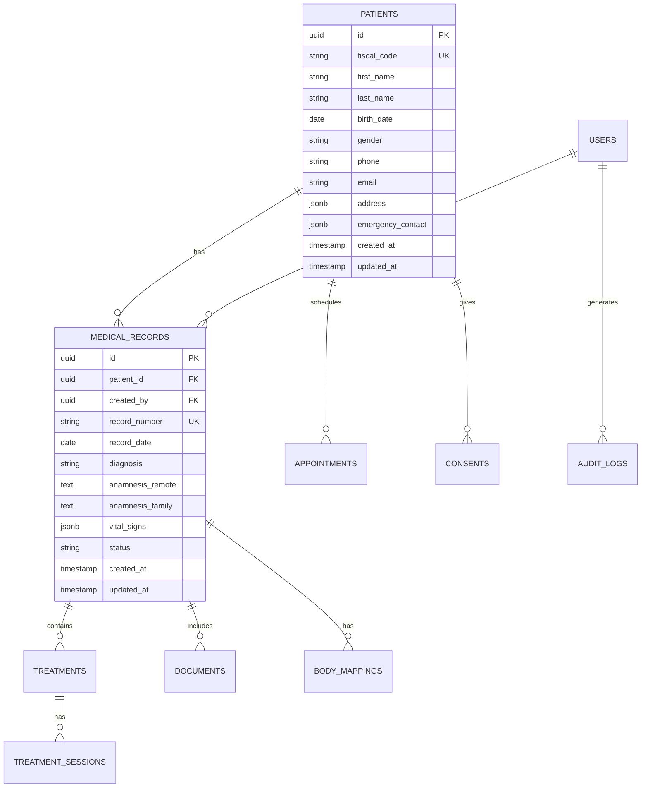

# 🗄️ DATABASE E MODELLI DATI

## Panoramica

Il sistema utilizza PostgreSQL come database principale, con un design ottimizzato per prestazioni, integrità dei dati e conformità GDPR.

---

## 📊 Schema Database

### Diagramma ER Principale



---

## 📋 Tabelle Principali

### 1. PATIENTS (Pazienti)
Anagrafica completa dei pazienti.

```sql
CREATE TABLE patients (
    id UUID PRIMARY KEY DEFAULT gen_random_uuid(),
    fiscal_code VARCHAR(16) UNIQUE NOT NULL,
    first_name VARCHAR(100) NOT NULL,
    last_name VARCHAR(100) NOT NULL,
    birth_date DATE NOT NULL,
    birth_place VARCHAR(200),
    gender CHAR(1) CHECK (gender IN ('M', 'F', 'O')),
    phone VARCHAR(20),
    email VARCHAR(255),
    address JSONB,
    emergency_contact JSONB,
    notes TEXT,
    tags TEXT[],
    is_active BOOLEAN DEFAULT true,
    created_at TIMESTAMP DEFAULT CURRENT_TIMESTAMP,
    updated_at TIMESTAMP DEFAULT CURRENT_TIMESTAMP,
    deleted_at TIMESTAMP
);

-- Indici
CREATE INDEX idx_patients_fiscal_code ON patients(fiscal_code);
CREATE INDEX idx_patients_full_name ON patients(last_name, first_name);
CREATE INDEX idx_patients_email ON patients(email);
CREATE INDEX idx_patients_phone ON patients(phone);
CREATE INDEX idx_patients_birth_date ON patients(birth_date);
```

### 2. MEDICAL_RECORDS (Cartelle Cliniche)
Cartelle cliniche digitali.

```sql
CREATE TABLE medical_records (
    id UUID PRIMARY KEY DEFAULT gen_random_uuid(),
    patient_id UUID NOT NULL REFERENCES patients(id),
    record_number VARCHAR(50) UNIQUE NOT NULL,
    record_date DATE NOT NULL,
    created_by UUID NOT NULL REFERENCES users(id),
    assigned_to UUID REFERENCES users(id),
    
    -- Dati clinici
    diagnosis TEXT,
    anamnesis_remote TEXT,
    anamnesis_family TEXT,
    anamnesis_physiological TEXT,
    anamnesis_pathological TEXT,
    
    -- Parametri vitali
    vital_signs JSONB DEFAULT '{}',
    /* Struttura JSONB:
    {
        "temperature": 36.5,
        "blood_pressure": {"systolic": 120, "diastolic": 80},
        "heart_rate": 70,
        "respiratory_rate": 16,
        "oxygen_saturation": 98,
        "weight": 75,
        "height": 175,
        "bmi": 24.5
    }
    */
    
    -- Esami e allergie
    allergies TEXT[],
    current_medications JSONB DEFAULT '[]',
    laboratory_results JSONB DEFAULT '[]',
    
    -- Stato
    status VARCHAR(20) DEFAULT 'draft',
    is_locked BOOLEAN DEFAULT false,
    locked_at TIMESTAMP,
    locked_by UUID REFERENCES users(id),
    
    -- Metadata
    tags TEXT[],
    notes TEXT,
    created_at TIMESTAMP DEFAULT CURRENT_TIMESTAMP,
    updated_at TIMESTAMP DEFAULT CURRENT_TIMESTAMP,
    deleted_at TIMESTAMP,
    
    CONSTRAINT check_status CHECK (
        status IN ('draft', 'active', 'completed', 'archived')
    )
);

-- Indici
CREATE INDEX idx_medical_records_patient ON medical_records(patient_id);
CREATE INDEX idx_medical_records_number ON medical_records(record_number);
CREATE INDEX idx_medical_records_date ON medical_records(record_date);
CREATE INDEX idx_medical_records_status ON medical_records(status);
```

### 3. TREATMENTS (Trattamenti)
Registro trattamenti e terapie.

```sql
CREATE TABLE treatments (
    id UUID PRIMARY KEY DEFAULT gen_random_uuid(),
    medical_record_id UUID NOT NULL REFERENCES medical_records(id),
    treatment_type VARCHAR(100) NOT NULL,
    treatment_name VARCHAR(255) NOT NULL,
    description TEXT,
    
    -- Dettagli trattamento
    start_date DATE NOT NULL,
    end_date DATE,
    frequency VARCHAR(50), -- giornaliero, settimanale, etc.
    duration_minutes INTEGER,
    total_sessions INTEGER,
    completed_sessions INTEGER DEFAULT 0,
    
    -- Parametri specifici
    parameters JSONB DEFAULT '{}',
    /* Esempi parametri per tipo:
    Laser: {"power": 10, "wavelength": 810, "dose": 5}
    Magnetoterapia: {"frequency": 50, "intensity": 30}
    Ultrasuoni: {"frequency": 1, "power": 2}
    */
    
    -- Prescrizione
    prescribed_by UUID REFERENCES users(id),
    prescription_date DATE,
    prescription_notes TEXT,
    
    -- Stato
    status VARCHAR(20) DEFAULT 'scheduled',
    outcome TEXT,
    
    created_at TIMESTAMP DEFAULT CURRENT_TIMESTAMP,
    updated_at TIMESTAMP DEFAULT CURRENT_TIMESTAMP,
    
    CONSTRAINT check_treatment_status CHECK (
        status IN ('scheduled', 'in_progress', 'completed', 'suspended', 'cancelled')
    )
);
```

### 4. TREATMENT_SESSIONS (Sessioni Trattamento)
Dettaglio singole sessioni.

```sql
CREATE TABLE treatment_sessions (
    id UUID PRIMARY KEY DEFAULT gen_random_uuid(),
    treatment_id UUID NOT NULL REFERENCES treatments(id),
    session_number INTEGER NOT NULL,
    session_date DATE NOT NULL,
    session_time TIME,
    
    -- Operatore
    performed_by UUID REFERENCES users(id),
    
    -- Dettagli sessione
    duration_minutes INTEGER,
    parameters_used JSONB,
    notes TEXT,
    
    -- Valutazioni
    pain_scale_pre INTEGER CHECK (pain_scale_pre BETWEEN 0 AND 10),
    pain_scale_post INTEGER CHECK (pain_scale_post BETWEEN 0 AND 10),
    patient_feedback TEXT,
    
    -- Stato
    status VARCHAR(20) DEFAULT 'scheduled',
    cancellation_reason TEXT,
    
    created_at TIMESTAMP DEFAULT CURRENT_TIMESTAMP,
    updated_at TIMESTAMP DEFAULT CURRENT_TIMESTAMP,
    
    CONSTRAINT check_session_status CHECK (
        status IN ('scheduled', 'completed', 'cancelled', 'no_show')
    ),
    
    UNIQUE(treatment_id, session_number)
);
```

### 5. BODY_MAPPINGS (Mappature Corporee)
Documentazione zone trattamento con body mapping.

```sql
CREATE TABLE body_mappings (
    id UUID PRIMARY KEY DEFAULT gen_random_uuid(),
    medical_record_id UUID NOT NULL REFERENCES medical_records(id),
    treatment_id UUID REFERENCES treatments(id),
    
    -- Identificazione zona
    body_part VARCHAR(100) NOT NULL,
    body_side VARCHAR(10), -- left, right, bilateral
    
    -- Coordinate e annotazioni
    mapping_data JSONB NOT NULL,
    /* Struttura:
    {
        "view": "anterior", // anterior, posterior, lateral_left, lateral_right
        "points": [
            {
                "x": 150,
                "y": 200,
                "type": "pain",
                "severity": 7,
                "description": "Dolore acuto"
            }
        ],
        "areas": [
            {
                "type": "polygon",
                "points": [[x1,y1], [x2,y2], ...],
                "color": "#ff0000",
                "description": "Area infiammata"
            }
        ]
    }
    */
    
    -- Immagini
    image_url TEXT,
    thumbnail_url TEXT,
    
    -- Metadata
    created_by UUID REFERENCES users(id),
    created_at TIMESTAMP DEFAULT CURRENT_TIMESTAMP,
    updated_at TIMESTAMP DEFAULT CURRENT_TIMESTAMP
);
```

### 6. DOCUMENTS (Documenti)
Gestione documentale.

```sql
CREATE TABLE documents (
    id UUID PRIMARY KEY DEFAULT gen_random_uuid(),
    medical_record_id UUID REFERENCES medical_records(id),
    patient_id UUID NOT NULL REFERENCES patients(id),
    
    -- Informazioni documento
    document_type VARCHAR(50) NOT NULL,
    title VARCHAR(255) NOT NULL,
    description TEXT,
    
    -- File
    file_name VARCHAR(255) NOT NULL,
    file_size INTEGER,
    mime_type VARCHAR(100),
    file_url TEXT NOT NULL,
    
    -- Versioning
    version INTEGER DEFAULT 1,
    parent_document_id UUID REFERENCES documents(id),
    
    -- Firma digitale
    is_signed BOOLEAN DEFAULT false,
    signed_by UUID REFERENCES users(id),
    signed_at TIMESTAMP,
    signature_data JSONB,
    
    -- Metadata
    tags TEXT[],
    uploaded_by UUID REFERENCES users(id),
    created_at TIMESTAMP DEFAULT CURRENT_TIMESTAMP,
    updated_at TIMESTAMP DEFAULT CURRENT_TIMESTAMP,
    deleted_at TIMESTAMP
);
```

### 7. APPOINTMENTS (Appuntamenti)
Gestione appuntamenti.

```sql
CREATE TABLE appointments (
    id UUID PRIMARY KEY DEFAULT gen_random_uuid(),
    patient_id UUID NOT NULL REFERENCES patients(id),
    medical_record_id UUID REFERENCES medical_records(id),
    treatment_id UUID REFERENCES treatments(id),
    
    -- Dettagli appuntamento
    appointment_date DATE NOT NULL,
    start_time TIME NOT NULL,
    end_time TIME NOT NULL,
    duration_minutes INTEGER,
    
    -- Assegnazione
    assigned_to UUID REFERENCES users(id),
    room VARCHAR(50),
    
    -- Informazioni
    appointment_type VARCHAR(50),
    reason TEXT,
    notes TEXT,
    
    -- Stato
    status VARCHAR(20) DEFAULT 'scheduled',
    confirmation_sent BOOLEAN DEFAULT false,
    confirmed_at TIMESTAMP,
    
    -- Cancellazione/Modifica
    cancelled_at TIMESTAMP,
    cancelled_by UUID REFERENCES users(id),
    cancellation_reason TEXT,
    rescheduled_from UUID REFERENCES appointments(id),
    
    created_at TIMESTAMP DEFAULT CURRENT_TIMESTAMP,
    updated_at TIMESTAMP DEFAULT CURRENT_TIMESTAMP,
    
    CONSTRAINT check_appointment_status CHECK (
        status IN ('scheduled', 'confirmed', 'completed', 'cancelled', 'no_show')
    )
);
```

### 8. USERS (Utenti)
Gestione utenti del sistema.

```sql
CREATE TABLE users (
    id UUID PRIMARY KEY DEFAULT gen_random_uuid(),
    email VARCHAR(255) UNIQUE NOT NULL,
    username VARCHAR(50) UNIQUE NOT NULL,
    password_hash VARCHAR(255) NOT NULL,
    
    -- Informazioni personali
    first_name VARCHAR(100) NOT NULL,
    last_name VARCHAR(100) NOT NULL,
    phone VARCHAR(20),
    
    -- Ruolo e permessi
    role VARCHAR(50) NOT NULL,
    permissions JSONB DEFAULT '[]',
    specialization VARCHAR(100),
    license_number VARCHAR(50),
    
    -- Stato account
    is_active BOOLEAN DEFAULT true,
    is_verified BOOLEAN DEFAULT false,
    verified_at TIMESTAMP,
    
    -- Login tracking
    last_login TIMESTAMP,
    login_count INTEGER DEFAULT 0,
    failed_login_attempts INTEGER DEFAULT 0,
    locked_until TIMESTAMP,
    
    -- Token
    reset_token VARCHAR(255),
    reset_token_expires TIMESTAMP,
    
    -- Preferenze
    preferences JSONB DEFAULT '{}',
    
    created_at TIMESTAMP DEFAULT CURRENT_TIMESTAMP,
    updated_at TIMESTAMP DEFAULT CURRENT_TIMESTAMP,
    deleted_at TIMESTAMP,
    
    CONSTRAINT check_role CHECK (
        role IN ('admin', 'doctor', 'nurse', 'therapist', 'receptionist', 'viewer')
    )
);
```

### 9. CONSENTS (Consensi)
Gestione consensi GDPR.

```sql
CREATE TABLE consents (
    id UUID PRIMARY KEY DEFAULT gen_random_uuid(),
    patient_id UUID NOT NULL REFERENCES patients(id),
    
    -- Tipo consenso
    consent_type VARCHAR(50) NOT NULL,
    consent_version VARCHAR(20) NOT NULL,
    
    -- Stato consenso
    is_granted BOOLEAN NOT NULL,
    granted_at TIMESTAMP,
    revoked_at TIMESTAMP,
    
    -- Dettagli
    ip_address INET,
    user_agent TEXT,
    signature_data JSONB,
    
    -- Scadenza
    expires_at TIMESTAMP,
    
    created_at TIMESTAMP DEFAULT CURRENT_TIMESTAMP,
    updated_at TIMESTAMP DEFAULT CURRENT_TIMESTAMP,
    
    CONSTRAINT check_consent_type CHECK (
        consent_type IN ('privacy', 'marketing', 'data_processing', 'data_sharing', 'research')
    )
);
```

### 10. AUDIT_LOGS (Log di Audit)
Tracciamento completo attività.

```sql
CREATE TABLE audit_logs (
    id UUID PRIMARY KEY DEFAULT gen_random_uuid(),
    user_id UUID REFERENCES users(id),
    
    -- Azione
    action VARCHAR(50) NOT NULL,
    entity_type VARCHAR(50) NOT NULL,
    entity_id UUID,
    
    -- Dettagli
    old_values JSONB,
    new_values JSONB,
    metadata JSONB,
    
    -- Context
    ip_address INET,
    user_agent TEXT,
    session_id VARCHAR(255),
    
    created_at TIMESTAMP DEFAULT CURRENT_TIMESTAMP
);

-- Indici per query performance
CREATE INDEX idx_audit_logs_user ON audit_logs(user_id);
CREATE INDEX idx_audit_logs_entity ON audit_logs(entity_type, entity_id);
CREATE INDEX idx_audit_logs_action ON audit_logs(action);
CREATE INDEX idx_audit_logs_created ON audit_logs(created_at);
```

---

## 🔧 Funzioni e Trigger

### Trigger Update Timestamp
```sql
CREATE OR REPLACE FUNCTION update_updated_at_column()
RETURNS TRIGGER AS $$
BEGIN
    NEW.updated_at = CURRENT_TIMESTAMP;
    RETURN NEW;
END;
$$ language 'plpgsql';

-- Applicare a tutte le tabelle con updated_at
CREATE TRIGGER update_patients_updated_at BEFORE UPDATE ON patients
    FOR EACH ROW EXECUTE FUNCTION update_updated_at_column();
```

### Funzione Soft Delete
```sql
CREATE OR REPLACE FUNCTION soft_delete()
RETURNS TRIGGER AS $$
BEGIN
    NEW.deleted_at = CURRENT_TIMESTAMP;
    NEW.is_active = false;
    RETURN NEW;
END;
$$ language 'plpgsql';
```

### Funzione Calcolo BMI
```sql
CREATE OR REPLACE FUNCTION calculate_bmi(height_cm NUMERIC, weight_kg NUMERIC)
RETURNS NUMERIC AS $$
BEGIN
    IF height_cm > 0 AND weight_kg > 0 THEN
        RETURN ROUND((weight_kg / POWER(height_cm / 100, 2))::NUMERIC, 2);
    ELSE
        RETURN NULL;
    END IF;
END;
$$ language 'plpgsql' IMMUTABLE;
```

---

## 🔐 Sicurezza Database

### Crittografia
```sql
-- Installare pgcrypto extension
CREATE EXTENSION IF NOT EXISTS pgcrypto;

-- Funzione per criptare dati sensibili
CREATE OR REPLACE FUNCTION encrypt_sensitive_data(data TEXT)
RETURNS TEXT AS $$
BEGIN
    RETURN encode(
        encrypt(
            data::bytea,
            current_setting('app.encryption_key')::bytea,
            'aes'
        ),
        'base64'
    );
END;
$$ language 'plpgsql' SECURITY DEFINER;
```

### Row Level Security (RLS)
```sql
-- Abilitare RLS su tabelle sensibili
ALTER TABLE patients ENABLE ROW LEVEL SECURITY;
ALTER TABLE medical_records ENABLE ROW LEVEL SECURITY;

-- Policy esempio: medici vedono solo propri pazienti
CREATE POLICY doctor_patient_policy ON patients
    FOR ALL
    TO doctor_role
    USING (
        id IN (
            SELECT patient_id 
            FROM medical_records 
            WHERE assigned_to = current_user_id()
        )
    );
```

---

## 📊 Ottimizzazioni

### Indici Consigliati
```sql
-- Ricerche frequenti
CREATE INDEX idx_patients_search 
ON patients USING gin(
    to_tsvector('italian', 
        coalesce(first_name, '') || ' ' || 
        coalesce(last_name, '') || ' ' || 
        coalesce(fiscal_code, '')
    )
);

-- Query di range su date
CREATE INDEX idx_appointments_date_range 
ON appointments(appointment_date, start_time)
WHERE status != 'cancelled';

-- Ricerca full-text su note
CREATE INDEX idx_medical_records_notes 
ON medical_records USING gin(to_tsvector('italian', notes));
```

### Partitioning
```sql
-- Partizionamento tabella audit_logs per mese
CREATE TABLE audit_logs_2025_08 PARTITION OF audit_logs
    FOR VALUES FROM ('2025-08-01') TO ('2025-09-01');
```

### Materialized Views
```sql
-- Vista materializzata per dashboard statistiche
CREATE MATERIALIZED VIEW patient_statistics AS
SELECT 
    COUNT(DISTINCT p.id) as total_patients,
    COUNT(DISTINCT mr.id) as total_records,
    COUNT(DISTINCT t.id) as total_treatments,
    DATE_TRUNC('month', p.created_at) as month
FROM patients p
LEFT JOIN medical_records mr ON p.id = mr.patient_id
LEFT JOIN treatments t ON mr.id = t.medical_record_id
GROUP BY DATE_TRUNC('month', p.created_at);

-- Refresh periodico
CREATE INDEX idx_patient_statistics_month ON patient_statistics(month);
```

---

## 🔄 Backup e Recovery

### Strategia di Backup
```bash
# Backup giornaliero completo
pg_dump -h localhost -U postgres -d cartella_clinica -F custom -f backup_$(date +%Y%m%d).dump

# Backup incrementale con pg_basebackup
pg_basebackup -h localhost -D /backup/base -U replicator -P -v

# Point-in-time recovery setup
archive_mode = on
archive_command = 'cp %p /archive/%f'
```

### Replica e HA
```sql
-- Configurazione streaming replication
-- Su primary
CREATE ROLE replicator WITH REPLICATION LOGIN PASSWORD 'secure_password';

-- postgresql.conf
wal_level = replica
max_wal_senders = 3
wal_keep_segments = 64
```

---

## 📈 Monitoring

### Query Monitoring
```sql
-- Query lente
CREATE EXTENSION IF NOT EXISTS pg_stat_statements;

-- Top 10 query per tempo totale
SELECT 
    query,
    calls,
    total_time,
    mean_time,
    max_time
FROM pg_stat_statements
ORDER BY total_time DESC
LIMIT 10;
```

### Health Checks
```sql
-- Connessioni attive
SELECT 
    datname,
    count(*) as connections,
    state
FROM pg_stat_activity
GROUP BY datname, state;

-- Dimensione database
SELECT 
    pg_database.datname,
    pg_size_pretty(pg_database_size(pg_database.datname)) as size
FROM pg_database
ORDER BY pg_database_size(pg_database.datname) DESC;
```

---

## 🔄 Migrazioni

### Struttura Migrazioni
```
/migrations
  ├── 001_initial_schema.sql
  ├── 002_add_body_mapping.sql
  ├── 003_add_consents.sql
  └── 004_optimize_indexes.sql
```

### Tool di Migrazione
Utilizzo di Prisma Migrate o Flyway per gestione versioni database.

---

*Documento mantenuto da: Team Database*
*Ultima revisione: Agosto 2025*
